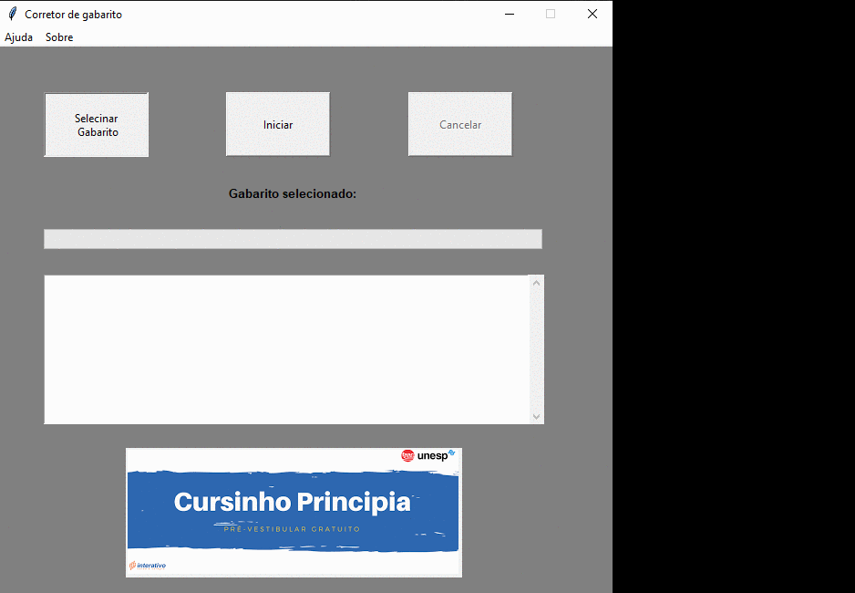

# RasProject - Gabarito

Este programa tem a finalidade de corrigir automaticamente as provas, sem a necessidade do trabalho mecânico humano. Para isso, basta tirar uma foto da prova do aluno com qualquer dispositivo e disponibilizar na pasta correspondente. Também é possível utilizar um scanner para tal fim. Para que o programa execute sua função normalmente é necessário que se utilize o modelo de gabarito disponibilizado na pasta raiz do git hub.
Tal programa foi desenvolvido pelo grupo Beta do Projetos Ras - IEEE - Unesp Bauru, sem fins lucrativos e com o objetivo de auxiliar o cursinho Princípia (Cursinho da Unesp Bauru).

## Começando

Essas instruçoes te dará uma copia deste projeto para rodar em seu computador para uso pessoal e não comercial.

### Pré-requisito

Para executar o programa corretor de gabaritos basta ter o sistema Windows e um descompactador de arquivos, como o WinRar instalado em sua máquina, e as bibliotecas caso rode o programa pelo Python.

```
-Sistema Operacional: Windows 7, Windowns 8 ou Windows 10 - 32/64bits
-Descompactador de arquivos: WinRar
-Bibliotecas: numpy
              opencv-python
              xlsxwriter

```

### Instalação

A instalação do programa corretor de gabaritos é bem simples, basta seguir os passos a seguir:

Executável:
```
1º Baixe a pasta que contem os arquivos em https://mega.nz/#F!aWZA0CKK!117qYt641MSt_CWW-J8aFA

2º Abra a pasta com os arquivos e execute o programa "main.exe".

3° Pronto! O programa corretor de gabaritos está pronto para ser utilizado.
```

Arquivo Python (rodar pelo terminal):
```
1° Após conferir a instalação do programa descompactador de arquivos em sua máquina é necessário baixar os arquivos do programa corretor de gabaritos clicando em "Clone or Download" na pasta do git e selecionando a opção "Download Zip".

2° Feito o download do arquivo zip, descompacte-o com seu descompactador de arquivos para o local desejado.

3° Abra o terminal e vá para o diretório da pasta do programa.

4º Execute o comando "python main.py".

5° Pronto! O programa corretor de gabaritos está pronto para ser utilizado.
```

### Como utilizar?

Para utilizar o programa corretor de gabaritos é necessário que ele esteja instalado em sua máquina. Para isso, execute os passos listados acima.

Feito isso, siga os passos a seguir:

1° Localize o arquivo "Gabarito-Oficial.jpg" que se encontra na pasta raiz do programa corretor de gabaritos. Esse arquivo será utilizado para impressão das provas.

2° Uma vez impressa todas as cópias necessárias para aplicação da prova, é necessário que se preencha uma das cópias com as respostas corretas das questões. Essa folha será lida posteriosmente no programa corretor de gabaritos como o modelo de respostas esperadas pelos alunos.

3° Feito o preenchimento das respostas corretas em uma das folhas, é necessário que se tire uma foto ou que esta folha "oficial" seja escaneada. Vale ressaltar que as provas escaneadas garantem mais precisão nos resultados. 

4° Após isso, abra o programa corretor de gabaritos.

5° Clique no botão "Selecione o Gabarito" e selecione o arquivo das respostas oficiais. Verifique se a opção "mostrar todos os tipos de aquivos" está habilitada.




6° Selecionado o arquivo das respostas oficiais, a pasta "ProvasParaCorrigir" será criada na pasta raíz do programa. É nesta pasta que deverá ser colocado todas as fotos ou scaners das provas dos alunos para que o programa possa corrigí-las.

7° Quando as provas dos alunos estiverem dentro da pasta "ProvasParaCorrigir", clique sobre o botão "Iniciar". Após isso, o programa irá começar o processo de correção das provas.

8° Quando o programa acabar de corrigir todas as provas, uma planilha excel com o nome "Resultados" irá ser criada na pasta raiz do programa, indicando o número de inscrição do aluno, quantos e quais foram os acertos. As imagens das provas corrigidas também serão enviadas para a pasta ProvasCorrigidas, dessa forma as imagens que possam ter tido grandes erros na correção permanecerá na pasta ProvasParaCorrigir. Dentro da pasta ProvasCorrigidas também será criada uma pasta chamada Resolucao. Nela será criada uma imagem para cada prova corrigida e como o programa as corrigiu afim de facilitar a revisão de determinada prova.

## Rodando testes prontos

Afim de testar o programa, existe uma pasta chamada "Backup de Fotos" dentro da pasta raiz que contem várias imagens de provas em diferentes angulações e métodos de captura. Também há uma imagem chamada gabaritoNovo.jpeg na pasta raiz.
Para executar os testes basta rodar o programa da forma mais conveniente (ver tópico Instalação e Como Utilizar), copiar as imagens da pasta "Backup de Fotos" para a pasta "ProvasParaCorrigir" e, na hora de selecionar o gabarito-base, ou seja o gabarito que contenha as respostas corretas, utilizar a imagem gabaritoNovo.jpeg. Ademais, seguir instruções dos tópicos anteriores.

## Feito com

* [Python 3.7](https://www.python.org/) - Linguagem usada
* [Opencv](https://opencv.org/) - Visão Computacional

## Autores

* **Pedro Caldato** - [pecaldato](https://github.com/pecaldato)
* **Leonardo Moreno** - [leopmoreno](https://github.com/leopmoreno)
* **Bruno Yudy** - [brunoyudy](https://github.com/brunoyudy)

* **Ras - IEEE** -[Unesp Bauru](https://www.bauru.unesp.br/)

## Licença

Este projeto é gratuito e sem fins comerciais! A comercialização do mesmo proibida!!
